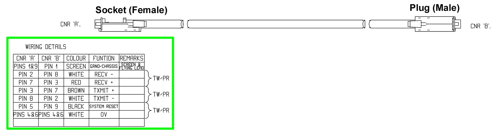

## Quantel PAD connector

The Paintbox uses RS422 as its communication protocol between the Paintbox and the PAD. The baud rate
is 9600 bps and is a one-way connection from PAD to Paintbox.

Where `CNR 'A'` connects to the PAD, and `CNR 'B'` connects to the Paintbox.

The Waveshare interface is RS485, which is a similar protocol but needs only two wires, A and B.
As the comms is only one way, we can connect the RECV+ and RECV- signals to the A and B terminals on the
Waveshare board, and pass TXMIT+ and TXMIT- through.
